# Design Document: Windows Performance Optimization

## Overview

This design document describes performance optimizations for the Fast File Deletion (FFD) tool on Windows systems. The current implementation achieves 659-790 files/sec using basic Win32 APIs (`windows.DeleteFile` and `windows.RemoveDirectory`). This optimization phase implements 12 advanced Windows-specific techniques to improve throughput while maintaining backward compatibility and graceful degradation.

The optimizations target three key areas:
1. **Advanced deletion methods**: Using lower-level Windows APIs for faster file removal
2. **Parallel scanning**: Multi-threaded directory traversal to eliminate scan bottlenecks
3. **Concurrency improvements**: Lock-free operations and adaptive worker tuning

## Architecture

### Current Architecture (Baseline)

The existing implementation follows a pipeline architecture:

```
CLI → Safety Validation → Scanner → Engine → Backend
                            ↓          ↓         ↓
                      filepath.WalkDir  Workers  DeleteFile/RemoveDirectory
```

**Current Performance Characteristics:**
- Scanner: Single-threaded `filepath.WalkDir` (~30s for 1M files)
- Engine: Worker pool with `NumCPU * 2` goroutines
- Backend: Basic Win32 APIs with UTF-16 conversion per call
- Synchronization: Mutex-protected counters
- Work distribution: Buffered channel (size 100)

### Optimized Architecture

The optimized implementation enhances each component:

```
CLI → Safety Validation → Parallel Scanner → Optimized Engine → Advanced Backend
                                ↓                  ↓                    ↓
                          FindFirstFileEx    Atomic counters    FileDispositionInfoEx
                          Parallel workers   NumCPU * 4         FILE_FLAG_DELETE_ON_CLOSE
                          UTF-16 pre-convert Dynamic buffer     NtDeleteFile
```

**Key Architectural Changes:**
1. **Scanner**: Parallel directory traversal with `FindFirstFileEx`
2. **Engine**: Atomic operations, adaptive worker count, larger buffers
3. **Backend**: Multiple deletion methods with automatic fallback chain
4. **Memory**: UTF-16 pre-conversion during scan phase

### Component Interactions

```mermaid
graph TD
    A[CLI] --> B[Safety Validator]
    B --> C[Parallel Scanner]
    C --> D[UTF-16 Pre-Converter]
    D --> E[Work Queue]
    E --> F[Worker Pool]
    F --> G[Advanced Backend]
    G --> H[Deletion Method Selector]
    H --> I[FileDispositionInfoEx]
    H --> J[FILE_FLAG_DELETE_ON_CLOSE]
    H --> K[NtDeleteFile]
    H --> L[DeleteFile Fallback]
    F --> M[Atomic Counters]
    M --> N[Progress Reporter]
```



## Components and Interfaces

### 1. Advanced Backend Interface

The backend interface remains unchanged for compatibility, but implementations gain new capabilities:

```go
// Backend interface (unchanged)
type Backend interface {
    DeleteFile(path string) error
    DeleteDirectory(path string) error
}

// New: DeletionMethod enum for method selection
type DeletionMethod int

const (
    MethodAuto DeletionMethod = iota  // Automatic selection with fallback
    MethodFileInfo                     // SetFileInformationByHandle
    MethodDeleteOnClose                // FILE_FLAG_DELETE_ON_CLOSE
    MethodNtAPI                        // NtDeleteFile
    MethodDeleteAPI                    // windows.DeleteFile (baseline)
)

// New: AdvancedBackend extends Backend with optimization features
type AdvancedBackend interface {
    Backend
    
    // SetDeletionMethod configures which deletion method to use
    SetDeletionMethod(method DeletionMethod)
    
    // GetDeletionStats returns statistics about deletion method usage
    GetDeletionStats() *DeletionStats
}

// DeletionStats tracks which methods were used and their success rates
type DeletionStats struct {
    FileInfoAttempts      int
    FileInfoSuccesses     int
    DeleteOnCloseAttempts int
    DeleteOnCloseSuccesses int
    NtAPIAttempts         int
    NtAPISuccesses        int
    FallbackAttempts      int
    FallbackSuccesses     int
}
```

### 2. Parallel Scanner

The scanner gains parallel traversal capabilities:

```go
// ParallelScanner extends Scanner with concurrent directory traversal
type ParallelScanner struct {
    rootPath      string
    keepDays      *int
    workers       int           // Number of parallel scan workers
    useWinAPI     bool          // Use FindFirstFileEx vs filepath.WalkDir
    preConvertUTF16 bool        // Pre-convert paths to UTF-16
}

// ScanResult gains UTF-16 path storage
type ScanResult struct {
    Files          []string      // UTF-8 paths (for compatibility)
    FilesUTF16     []*uint16     // Pre-converted UTF-16 paths (Windows only)
    TotalScanned   int
    TotalToDelete  int
    TotalRetained  int
    TotalSizeBytes int64
    ScanDuration   time.Duration // New: track scan time
}

// NewParallelScanner creates a scanner with parallel capabilities
func NewParallelScanner(rootPath string, keepDays *int, workers int) *ParallelScanner

// Scan performs parallel directory traversal (Windows-optimized)
func (s *ParallelScanner) Scan() (*ScanResult, error)
```

**Parallel Scanning Algorithm:**

1. Start with root directory in work queue
2. Spawn N worker goroutines (default: NumCPU)
3. Each worker:
   - Dequeues a directory
   - Calls `FindFirstFileEx` to enumerate entries
   - For each entry:
     - If file: add to results (with UTF-16 conversion)
     - If directory: enqueue for processing
4. Workers synchronize using WaitGroup
5. Results collected in thread-safe slice

**Fallback Strategy:**
- If `FindFirstFileEx` unavailable: use `filepath.WalkDir`
- If parallel scan fails: fall back to sequential scan
- Errors logged but don't stop scan

### 3. Optimized Engine

The engine gains atomic operations and adaptive tuning:

```go
// Engine gains configuration options
type Engine struct {
    backend          backend.Backend
    workers          int
    bufferSize       int              // New: configurable buffer
    progressCallback func(int)
    useAtomics       bool             // New: use atomic counters
    adaptiveWorkers  bool             // New: auto-tune worker count
}

// EngineConfig provides configuration options
type EngineConfig struct {
    Workers         int              // Worker count (0 = auto)
    BufferSize      int              // Work queue size (0 = auto)
    UseAtomics      bool             // Use atomic counters
    AdaptiveWorkers bool             // Enable adaptive tuning
}

// NewEngineWithConfig creates engine with custom configuration
func NewEngineWithConfig(backend backend.Backend, config EngineConfig, progressCallback func(int)) *Engine

// DeletionResult gains performance metrics
type DeletionResult struct {
    DeletedCount    int
    FailedCount     int
    Errors          []FileError
    DurationSeconds float64
    PeakRate        float64          // New: peak files/sec
    AverageRate     float64          // New: average files/sec
    WorkerCount     int              // New: actual workers used
}
```

**Atomic Counter Implementation:**

```go
// Replace mutex-protected counters with atomics
type atomicCounters struct {
    deleted atomic.Int64
    failed  atomic.Int64
}

// Worker updates counters without locks
func (e *Engine) worker(ctx context.Context, workChan <-chan string, ...) {
    for path := range workChan {
        err := e.deleteFile(path, dryRun)
        if err != nil {
            counters.failed.Add(1)
        } else {
            counters.deleted.Add(1)
        }
    }
}
```

**Adaptive Worker Tuning:**

```go
// Monitor deletion rate and adjust workers dynamically
func (e *Engine) adaptiveWorkerTuning(ctx context.Context, counters *atomicCounters) {
    ticker := time.NewTicker(5 * time.Second)
    defer ticker.Stop()
    
    lastCount := int64(0)
    for {
        select {
        case <-ctx.Done():
            return
        case <-ticker.C:
            currentCount := counters.deleted.Load()
            rate := float64(currentCount - lastCount) / 5.0
            
            // If rate is low and workers < NumCPU*8, add workers
            // If rate is high and stable, maintain current workers
            // Implementation details in code
        }
    }
}
```

### 4. Deletion Method Implementations

#### Method 1: SetFileInformationByHandle (FileDispositionInfoEx)

**Advantages:**
- POSIX delete semantics (delete-on-close)
- Handles read-only files automatically
- Bypasses some permission checks
- Fastest method on Windows 10 RS1+

**Implementation:**

```go
func (b *WindowsBackend) deleteWithFileInfo(path *uint16) error {
    // Open file with DELETE access
    handle, err := windows.CreateFile(
        path,
        windows.DELETE,
        windows.FILE_SHARE_DELETE|windows.FILE_SHARE_READ|windows.FILE_SHARE_WRITE,
        nil,
        windows.OPEN_EXISTING,
        windows.FILE_FLAG_BACKUP_SEMANTICS, // Required for directories
        0,
    )
    if err != nil {
        return err
    }
    defer windows.CloseHandle(handle)
    
    // Try FileDispositionInfoEx first (Windows 10 RS1+)
    infoEx := windows.FILE_DISPOSITION_INFO_EX{
        Flags: windows.FILE_DISPOSITION_FLAG_DELETE |
               windows.FILE_DISPOSITION_FLAG_POSIX_SEMANTICS |
               windows.FILE_DISPOSITION_FLAG_IGNORE_READONLY_ATTRIBUTE,
    }
    
    err = windows.SetFileInformationByHandle(
        handle,
        windows.FileDispositionInfoEx,
        (*byte)(unsafe.Pointer(&infoEx)),
        uint32(unsafe.Sizeof(infoEx)),
    )
    
    if err == windows.ERROR_INVALID_PARAMETER {
        // Fall back to FileDispositionInfo (older Windows)
        info := windows.FILE_DISPOSITION_INFO{DeleteFile: true}
        err = windows.SetFileInformationByHandle(
            handle,
            windows.FileDispositionInfo,
            (*byte)(unsafe.Pointer(&info)),
            uint32(unsafe.Sizeof(info)),
        )
    }
    
    return err
}
```

#### Method 2: FILE_FLAG_DELETE_ON_CLOSE

**Advantages:**
- Single syscall (CreateFile + CloseHandle)
- Automatic cleanup on handle close
- Works on older Windows versions

**Implementation:**

```go
func (b *WindowsBackend) deleteWithDeleteOnClose(path *uint16) error {
    // Open with DELETE_ON_CLOSE flag
    handle, err := windows.CreateFile(
        path,
        windows.DELETE,
        windows.FILE_SHARE_DELETE|windows.FILE_SHARE_READ|windows.FILE_SHARE_WRITE,
        nil,
        windows.OPEN_EXISTING,
        windows.FILE_FLAG_DELETE_ON_CLOSE|windows.FILE_FLAG_BACKUP_SEMANTICS,
        0,
    )
    if err != nil {
        return err
    }
    
    // File deleted when handle closes
    return windows.CloseHandle(handle)
}
```

#### Method 3: NtDeleteFile (Native API)

**Advantages:**
- Bypasses Win32 layer entirely
- Lowest overhead
- Direct kernel call

**Implementation:**

```go
// NtDeleteFile is not exposed by golang.org/x/sys/windows
// We need to load it dynamically from ntdll.dll

var (
    ntdll        = windows.NewLazySystemDLL("ntdll.dll")
    ntDeleteFile = ntdll.NewProc("NtDeleteFile")
)

func (b *WindowsBackend) deleteWithNtAPI(path *uint16) error {
    // Convert path to UNICODE_STRING
    var objAttr windows.OBJECT_ATTRIBUTES
    var unicodeStr windows.UNICODE_STRING
    
    windows.RtlInitUnicodeString(&unicodeStr, path)
    windows.InitializeObjectAttributes(
        &objAttr,
        &unicodeStr,
        windows.OBJ_CASE_INSENSITIVE,
        0,
        nil,
    )
    
    // Call NtDeleteFile
    ret, _, _ := ntDeleteFile.Call(uintptr(unsafe.Pointer(&objAttr)))
    
    if ret != 0 {
        return fmt.Errorf("NtDeleteFile failed with status 0x%X", ret)
    }
    
    return nil
}
```

#### Method 4: DeleteFile (Baseline Fallback)

The existing implementation serves as the final fallback:

```go
func (b *WindowsBackend) deleteWithDeleteAPI(path *uint16) error {
    return windows.DeleteFile(path)
}
```

### 5. UTF-16 Pre-Conversion

**Problem:** Current implementation converts paths to UTF-16 on every deletion call, causing repeated allocations.

**Solution:** Convert once during scan, store UTF-16 pointers, reuse during deletion.

```go
// During scan phase
func (s *ParallelScanner) convertToUTF16(path string) (*uint16, error) {
    extendedPath := toExtendedLengthPath(path)
    return syscall.UTF16PtrFromString(extendedPath)
}

// Store in ScanResult
result.FilesUTF16 = append(result.FilesUTF16, utf16Path)

// During deletion phase
func (b *WindowsBackend) DeleteFile(path string) error {
    // If UTF-16 path available, use it directly
    if b.hasPreconvertedPath {
        return b.deleteWithPreconvertedPath(b.currentUTF16Path)
    }
    
    // Otherwise, convert on-demand (fallback)
    pathPtr, err := syscall.UTF16PtrFromString(toExtendedLengthPath(path))
    if err != nil {
        return err
    }
    return b.deleteWithPreconvertedPath(pathPtr)
}
```

### 6. Benchmarking Mode

**Purpose:** Compare all deletion methods to identify the fastest for specific scenarios.

```go
// BenchmarkConfig specifies benchmarking parameters
type BenchmarkConfig struct {
    Methods      []DeletionMethod  // Methods to test
    Iterations   int               // Files to delete per method
    TestDir      string            // Directory with test files
}

// BenchmarkResult contains timing for each method
type BenchmarkResult struct {
    Method          DeletionMethod
    FilesPerSecond  float64
    TotalTime       time.Duration
    SyscallCount    int
    MemoryUsed      int64
}

// RunBenchmark executes comparative benchmarks
func RunBenchmark(config BenchmarkConfig) ([]BenchmarkResult, error) {
    results := make([]BenchmarkResult, 0, len(config.Methods))
    
    for _, method := range config.Methods {
        // Create fresh test files
        testFiles := createTestFiles(config.TestDir, config.Iterations)
        
        // Configure backend for this method
        backend := NewWindowsBackend()
        backend.SetDeletionMethod(method)
        
        // Measure deletion
        start := time.Now()
        for _, file := range testFiles {
            backend.DeleteFile(file)
        }
        duration := time.Since(start)
        
        results = append(results, BenchmarkResult{
            Method:         method,
            FilesPerSecond: float64(config.Iterations) / duration.Seconds(),
            TotalTime:      duration,
        })
    }
    
    return results, nil
}
```

## Data Models

### Path Representation

```go
// PathInfo stores both UTF-8 and UTF-16 representations
type PathInfo struct {
    UTF8Path   string    // Original path (for logging, display)
    UTF16Path  *uint16   // Pre-converted for Windows APIs
    IsDirectory bool     // Avoid double-call pattern
    Size       int64     // For progress reporting
    Depth      int       // For bottom-up ordering
}
```

### Performance Metrics

```go
// PerformanceMetrics tracks detailed performance data
type PerformanceMetrics struct {
    ScanDuration    time.Duration
    QueueDuration   time.Duration
    DeleteDuration  time.Duration
    TotalDuration   time.Duration
    
    FilesScanned    int64
    FilesDeleted    int64
    FilesFailed     int64
    
    PeakRate        float64  // Files/sec at peak
    AverageRate     float64  // Overall files/sec
    
    MemoryUsedMB    int64    // Peak memory usage
    WorkerCount     int      // Actual workers used
    
    MethodStats     *DeletionStats  // Per-method statistics
}
```

## Correctness Properties

*A property is a characteristic or behavior that should hold true across all valid executions of a system—essentially, a formal statement about what the system should do. Properties serve as the bridge between human-readable specifications and machine-verifiable correctness guarantees.*


### Deletion Method Properties

**Property 1: Fallback chain completeness**
*For any* file deletion attempt, when a deletion method fails or is unavailable, the backend should try the next method in the fallback chain (FileDispositionInfoEx → FileDispositionInfo → DeleteFile) until one succeeds or all methods are exhausted.
**Validates: Requirements 1.1, 1.2, 1.3**

**Property 2: Read-only file handling**
*For any* file with read-only attributes, when deletion fails with access denied, the backend should clear the read-only attribute and retry deletion successfully.
**Validates: Requirements 1.4**

**Property 3: FILE_FLAG_DELETE_ON_CLOSE correctness**
*For any* file, when using FILE_FLAG_DELETE_ON_CLOSE method, the file should be deleted successfully after the handle is closed.
**Validates: Requirements 1.5**

**Property 4: NtDeleteFile correctness**
*For any* file, when using NtDeleteFile method, the file should be deleted successfully and NT status codes should be translated to readable error messages.
**Validates: Requirements 1.6, 8.4**

### Performance Properties

**Property 5: Optimized throughput improvement**
*For any* sufficiently large set of files (>10,000), the optimized implementation should achieve higher files-per-second throughput than the baseline implementation (659-790 files/sec).
**Validates: Requirements 2.1**

**Property 6: Parallel scan performance**
*For any* directory tree, the parallel scanner should complete traversal faster than the baseline filepath.WalkDir implementation.
**Validates: Requirements 2.2**

**Property 7: Sub-linear memory scaling**
*For any* file count N, memory consumption should scale sub-linearly (not O(N)), demonstrating efficient memory management.
**Validates: Requirements 2.3**

### Scanning Properties

**Property 8: Parallel subdirectory processing**
*For any* directory tree with multiple subdirectories, the scanner should process subdirectories concurrently using multiple goroutines.
**Validates: Requirements 3.2**

**Property 9: Bottom-up ordering invariant**
*For any* directory tree, the scan result should list all files in bottom-up order where every file appears before its parent directory.
**Validates: Requirements 3.3**

**Property 10: UTF-16 pre-conversion completeness**
*For any* path in the scan result, a UTF-16 representation should be pre-converted and stored during the scan phase.
**Validates: Requirements 3.4, 5.1**

**Property 11: Scan fallback correctness**
*For any* directory tree, when parallel scanning fails or is unavailable, the scanner should fall back to sequential filepath.WalkDir and produce equivalent results.
**Validates: Requirements 3.5**

### Concurrency Properties

**Property 12: Buffer size calculation**
*For any* file count N, the work queue buffer size should equal min(N, 10000), preventing unbounded memory growth.
**Validates: Requirements 4.3, 5.4**

**Property 13: Adaptive worker adjustment**
*For any* deletion operation with adaptive tuning enabled, worker count should adjust based on measured deletion rates to optimize throughput.
**Validates: Requirements 4.4**

**Property 14: Skip double-call optimization**
*For any* path identified as a directory, the backend should call only DeleteDirectory without first attempting DeleteFile.
**Validates: Requirements 4.5**

### Memory Optimization Properties

**Property 15: UTF-16 reuse without re-conversion**
*For any* path with pre-converted UTF-16 representation, deletion should reuse the stored UTF-16 pointer without performing re-conversion or allocating new buffers.
**Validates: Requirements 5.2, 5.3**

**Property 16: Batch memory release**
*For any* deletion operation processing multiple batches, memory from completed batches should be released before processing subsequent batches.
**Validates: Requirements 5.5**

### Benchmarking Properties

**Property 17: Benchmark isolation**
*For any* benchmarking run, each deletion method should execute on fresh, isolated test data to ensure fair comparison without interference.
**Validates: Requirements 6.5**

### Backward Compatibility Properties

**Property 18: Version-based fallback**
*For any* Windows version older than Windows 10 RS1, the system should automatically select compatible deletion methods without requiring user intervention.
**Validates: Requirements 7.1, 7.5**

**Property 19: CLI consistency across versions**
*For any* Windows version, the same command-line arguments should produce equivalent behavior (even if internal implementation differs).
**Validates: Requirements 7.3**

### Error Handling Properties

**Property 20: Deletion method fallback on failure**
*For any* file where a deletion method fails, the backend should attempt the next method in the fallback chain before reporting failure.
**Validates: Requirements 8.2, 8.1**

**Property 21: Error resilience**
*For any* file that fails deletion after all retry attempts, the system should log the error, increment the failure count, and continue processing remaining files.
**Validates: Requirements 8.3, 8.5**

### Configuration Properties

**Property 22: Worker count override**
*For any* worker count specified via --workers flag, the system should use that count instead of the default NumCPU * 4.
**Validates: Requirements 11.1**

**Property 23: Buffer size override**
*For any* buffer size specified via --buffer-size flag, the system should use that size for the work queue.
**Validates: Requirements 11.2**

**Property 24: Deletion method selection**
*For any* deletion method specified via --deletion-method flag, the system should use only that method (without fallback) if it's available on the current Windows version.
**Validates: Requirements 11.3, 11.4**

**Property 25: Invalid configuration handling**
*For any* invalid configuration (unsupported method, negative worker count, etc.), the system should display an error message and exit with code 2.
**Validates: Requirements 11.5**

### Monitoring Properties

**Property 26: Periodic rate reporting**
*For any* deletion operation in progress, the system should report the current deletion rate at 5-second intervals.
**Validates: Requirements 12.3**

## Error Handling

### Error Categories

1. **API Unavailability**: Advanced APIs not available on older Windows versions
2. **Access Denied**: Insufficient permissions or read-only files
3. **File Locked**: File in use by another process
4. **Path Too Long**: Path exceeds Windows limits (handled by extended-length paths)
5. **NT Status Codes**: Native API errors requiring translation

### Fallback Strategy

```
Deletion Attempt
    ↓
Try FileDispositionInfoEx
    ↓ (if fails or unavailable)
Try FileDispositionInfo
    ↓ (if fails or unavailable)
Try DeleteFile
    ↓ (if fails)
Log error, continue with next file
```

### Error Translation

NT status codes must be translated to human-readable messages:

```go
func translateNTStatus(status uint32) string {
    switch status {
    case 0xC0000022: // STATUS_ACCESS_DENIED
        return "Access denied"
    case 0xC0000034: // STATUS_OBJECT_NAME_NOT_FOUND
        return "File not found"
    case 0xC0000043: // STATUS_SHARING_VIOLATION
        return "File is in use"
    case 0xC000003A: // STATUS_OBJECT_PATH_NOT_FOUND
        return "Path not found"
    default:
        return fmt.Sprintf("NT status 0x%X", status)
    }
}
```

### Read-Only File Handling

When encountering access denied errors, attempt to clear read-only attribute:

```go
func (b *WindowsBackend) clearReadOnlyAndRetry(path *uint16) error {
    // Get current attributes
    attrs, err := windows.GetFileAttributes(path)
    if err != nil {
        return err
    }
    
    // Clear read-only bit
    newAttrs := attrs &^ windows.FILE_ATTRIBUTE_READONLY
    
    // Set new attributes
    err = windows.SetFileAttributes(path, newAttrs)
    if err != nil {
        return err
    }
    
    // Retry deletion
    return b.deleteWithCurrentMethod(path)
}
```

## Testing Strategy

### Dual Testing Approach

The testing strategy combines unit tests for specific scenarios with property-based tests for universal correctness:

**Unit Tests:**
- Specific deletion method invocations
- Fallback chain verification
- Error handling for known scenarios
- CLI flag parsing
- Configuration validation
- Benchmark output format

**Property-Based Tests:**
- Deletion correctness across all methods (files are actually deleted)
- Fallback chain completeness (all methods tried in order)
- Bottom-up ordering invariant (children before parents)
- UTF-16 conversion happens exactly once
- Memory scaling is sub-linear
- Performance improvement over baseline
- Error resilience (failures don't stop processing)

### Property Test Configuration

All property tests should run with minimum 100 iterations using the Rapid framework:

```go
func TestDeletionMethodFallback(t *testing.T) {
    rapid.Check(t, func(t *rapid.T) {
        // Generate random file path
        path := rapid.String().Draw(t, "path")
        
        // Test property: fallback chain is followed
        backend := NewWindowsBackend()
        backend.simulateMethodFailure(MethodFileInfo)
        backend.simulateMethodFailure(MethodFileInfoEx)
        
        err := backend.DeleteFile(path)
        
        // Verify DeleteFile was eventually called
        assert.True(t, backend.methodCalled(MethodDeleteAPI))
    })
}
```

### Test Tags

Each property test must reference its design document property:

```go
// Feature: windows-performance-optimization, Property 1: Fallback chain completeness
func TestFallbackChainCompleteness(t *testing.T) { ... }

// Feature: windows-performance-optimization, Property 9: Bottom-up ordering invariant
func TestBottomUpOrdering(t *testing.T) { ... }
```

### Integration Tests

Integration tests measure actual performance on real directory structures:

```go
func TestPerformanceImprovement(t *testing.T) {
    // Create test directory with 100,000 files
    testDir := createTestDirectory(t, 100000)
    defer os.RemoveAll(testDir)
    
    // Measure baseline performance
    baselineRate := measureDeletionRate(t, testDir, NewWindowsBackend())
    
    // Measure optimized performance
    optimizedBackend := NewAdvancedWindowsBackend()
    optimizedBackend.SetDeletionMethod(MethodFileInfo)
    optimizedRate := measureDeletionRate(t, testDir, optimizedBackend)
    
    // Verify improvement
    assert.Greater(t, optimizedRate, baselineRate)
}
```

### Benchmarking Tests

Benchmark tests compare all deletion methods:

```go
func BenchmarkDeletionMethods(b *testing.B) {
    methods := []DeletionMethod{
        MethodFileInfo,
        MethodDeleteOnClose,
        MethodNtAPI,
        MethodDeleteAPI,
    }
    
    for _, method := range methods {
        b.Run(method.String(), func(b *testing.B) {
            backend := NewAdvancedWindowsBackend()
            backend.SetDeletionMethod(method)
            
            b.ResetTimer()
            for i := 0; i < b.N; i++ {
                // Create and delete test file
                testFile := createTestFile(b)
                backend.DeleteFile(testFile)
            }
        })
    }
}
```

### Platform-Specific Tests

Windows-specific tests use build tags:

```go
//go:build windows

func TestFileDispositionInfoEx(t *testing.T) {
    // Test only runs on Windows
    backend := NewAdvancedWindowsBackend()
    backend.SetDeletionMethod(MethodFileInfo)
    
    testFile := createTestFile(t)
    err := backend.DeleteFile(testFile)
    
    assert.NoError(t, err)
    assert.False(t, fileExists(testFile))
}
```

### Test Data Organization

```
testdata/
├── rapid/                          # Property-based test data
│   ├── deletion_fallback.fail     # Preserved failure cases
│   ├── utf16_conversion.fail
│   └── bottom_up_ordering.fail
├── benchmark/                      # Benchmark test directories
│   ├── small_files/               # 10,000 files < 1KB
│   ├── medium_files/              # 100,000 files ~10KB
│   └── large_files/               # 1,000,000 files ~100KB
└── integration/                    # Integration test data
    ├── deep_nesting/              # Test long paths
    ├── readonly_files/            # Test attribute handling
    └── mixed_content/             # Files + directories
```

## Implementation Notes

### Windows Version Detection

```go
func getWindowsVersion() (major, minor, build uint32) {
    version := windows.RtlGetVersion()
    return version.MajorVersion, version.MinorVersion, version.BuildNumber
}

func supportsFileDispositionInfoEx() bool {
    major, minor, build := getWindowsVersion()
    // Windows 10 RS1 = 10.0.14393
    return major > 10 || (major == 10 && build >= 14393)
}
```

### Dynamic API Loading

For NtDeleteFile, use dynamic loading since it's not exposed by golang.org/x/sys/windows:

```go
var (
    ntdll        = windows.NewLazySystemDLL("ntdll.dll")
    ntDeleteFile = ntdll.NewProc("NtDeleteFile")
)

func init() {
    // Verify NtDeleteFile is available
    if err := ntDeleteFile.Find(); err != nil {
        logger.Warning("NtDeleteFile not available: %v", err)
    }
}
```

### Memory Profiling

Enable memory profiling for optimization verification:

```go
import _ "net/http/pprof"

func main() {
    if os.Getenv("FFD_PROFILE") == "1" {
        go func() {
            http.ListenAndServe("localhost:6060", nil)
        }()
    }
    // ... rest of main
}
```

### Build Tags

Ensure proper build tag usage:

```go
//go:build windows

// windows_optimized.go - Windows-specific optimizations

//go:build !windows

// generic_fallback.go - Generic implementations
```
