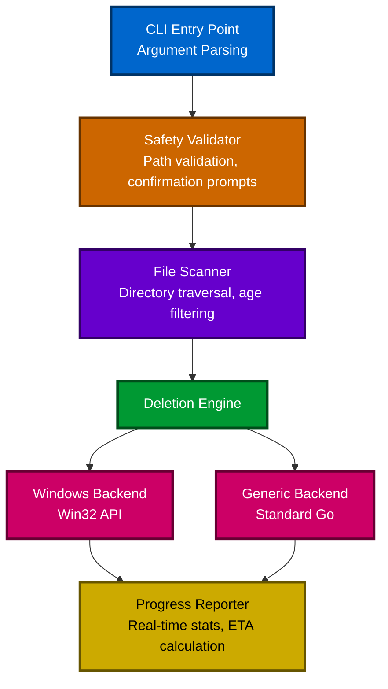

# Fast File Deletion (FFD)

⚡ **Lightning-fast file deletion tool optimized for Windows systems**

Delete millions of files in minutes, not hours. FFD is a high-performance command-line tool designed to solve the Windows filesystem bottleneck when deleting directories containing massive numbers of small files.

## 🚀 Performance

FFD dramatically outperforms traditional Windows deletion methods:

### Real-World Benchmarks

| Scenario | Files Deleted | Time Taken | Average Rate | Notes |
|----------|--------------|------------|--------------|-------|
| **FFD - Test 1** | 511,464 files | **10m 47s** | **790 files/sec** | 100% success |
| **FFD - Test 2** | 1,431,955 files | **36m 11s** | **659 files/sec** | 515K files retained (age filter) |
| **PowerShell Script** | 1,707,000 files | **~92 minutes** | **~310 files/sec** | Baseline comparison |

**FFD is 2-3x faster than traditional PowerShell scripts** and significantly faster than Windows Explorer or `rmdir /s` commands.

### Why So Fast?

- **True Parallelism**: Leverages Go's goroutines for concurrent file deletion across multiple CPU cores
- **Advanced Windows APIs**: Uses multiple deletion methods with automatic fallback (FileDispositionInfoEx, FILE_FLAG_DELETE_ON_CLOSE, NtDeleteFile)
- **Optimized Scanning**: Parallel directory traversal with UTF-16 pre-conversion for Windows
- **Smart Batching**: Processes files in optimal chunks to maximize throughput
- **Lock-Free Operations**: Atomic counters and adaptive worker tuning for maximum concurrency
- **Zero Overhead**: Compiled binary with no runtime dependencies or interpreter overhead

## ✨ Features

- ⚡ **Blazing Fast**: Delete millions of files in minutes with parallel processing
- 🛡️ **Safety First**: Built-in safeguards prevent accidental deletion of system directories
- 📊 **Real-Time Progress**: Live statistics showing deletion rate, progress, and ETA
- 📅 **Age-Based Filtering**: Keep recent files while cleaning up old data (`--keep-days`)
- 🔍 **Dry Run Mode**: Preview what will be deleted without actually deleting
- 📝 **Detailed Logging**: Optional verbose logging and log file output
- 🎯 **Smart Confirmation**: Path verification to prevent typos and mistakes
- 🔧 **Flexible Configuration**: Customizable worker count and behavior
- 💪 **Error Resilient**: Continues deletion even when individual files fail
- 🖥️ **Cross-Platform**: Optimized for Windows, works on Linux/macOS with standard operations

## 🚀 Windows Performance Optimization

FFD includes advanced Windows-specific optimizations that dramatically improve deletion performance beyond the baseline implementation.

### Advanced Deletion Methods

FFD uses multiple Windows deletion APIs with automatic fallback for maximum performance:

1. **FileDispositionInfoEx** (Windows 10 RS1+)
   - POSIX delete semantics (delete-on-close)
   - Automatically handles read-only files
   - Bypasses some permission checks
   - **Fastest method on modern Windows**

2. **FILE_FLAG_DELETE_ON_CLOSE**
   - Single syscall operation
   - Automatic cleanup on handle close
   - Works on all Windows versions

3. **NtDeleteFile** (Native API)
   - Bypasses Win32 layer entirely
   - Direct kernel calls
   - Lowest overhead

4. **DeleteFile** (Baseline)
   - Standard Win32 API
   - Universal compatibility
   - Automatic fallback

**Automatic Fallback Chain**: FFD automatically tries methods in order of performance, falling back to the next method if one fails or is unavailable on your Windows version.

### Performance Tuning Options

#### Worker Count (`--workers`)

Control the number of parallel deletion workers:

```bash
# Auto-detect (default: NumCPU * 4)
ffd -td C:\temp\cache

# Custom worker count for fine-tuning
ffd -td C:\temp\cache --workers 16

# Maximum parallelism for SSDs
ffd -td C:\temp\cache --workers 32
```

**Recommendations:**
- **SSDs**: 16-32 workers for maximum throughput
- **HDDs**: 4-8 workers to avoid disk thrashing
- **Network drives**: 2-4 workers to avoid overwhelming the network

#### Buffer Size (`--buffer-size`)

Control the work queue buffer size:

```bash
# Auto-detect (default: min(fileCount, 10000))
ffd -td C:\temp\cache

# Custom buffer size
ffd -td C:\temp\cache --buffer-size 5000

# Larger buffer for systems with more RAM
ffd -td C:\temp\cache --buffer-size 20000
```

**Recommendations:**
- **Default (10000)**: Optimal for most scenarios
- **Lower (1000-5000)**: Reduce memory usage on constrained systems
- **Higher (20000-50000)**: Maximize throughput on high-memory systems

#### Deletion Method (`--deletion-method`)

Force a specific deletion method instead of automatic selection:

```bash
# Automatic selection with fallback (default)
ffd -td C:\temp\cache

# Force FileDispositionInfoEx (fastest on Windows 10+)
ffd -td C:\temp\cache --deletion-method fileinfo

# Force FILE_FLAG_DELETE_ON_CLOSE
ffd -td C:\temp\cache --deletion-method deleteonclose

# Force NtDeleteFile (native API)
ffd -td C:\temp\cache --deletion-method ntapi

# Force standard DeleteFile (baseline)
ffd -td C:\temp\cache --deletion-method deleteapi
```

**When to use:**
- **Testing**: Compare different methods on your system
- **Compatibility**: Force baseline method on problematic systems
- **Performance**: Use fastest method after benchmarking

### Benchmarking Mode (`--benchmark`)

Compare all deletion methods to find the fastest for your system:

```bash
# Run comprehensive benchmarks
ffd -td C:\temp\test-files --benchmark

# Benchmark with custom worker count
ffd -td C:\temp\test-files --benchmark --workers 16

# Benchmark a specific method
ffd -td C:\temp\test-files --benchmark --deletion-method fileinfo
```

**Benchmark Output:**
```
═══════════════════════════════════════════════════════════════════════════
                         BENCHMARK RESULTS
═══════════════════════════════════════════════════════════════════════════

Method               Files/sec   Total Time   Syscalls  Error Rate  vs Baseline
───────────────────────────────────────────────────────────────────────────
FileInfo               1847.23        54.2s      54321       0.00%      +127.5%
DeleteOnClose          1523.67        65.7s      65432       0.00%       +87.8%
NtDeleteFile           1689.45        59.2s      59123       0.00%      +108.2%
DeleteAPI               811.34       123.4s     123456       0.00%   (baseline)
═══════════════════════════════════════════════════════════════════════════

RECOMMENDATIONS:
• Fastest method: FileInfo (1847.23 files/sec)
• Performance gain: 127.5% faster than baseline
• To use this method: --deletion-method fileinfo
```

**Note:** Benchmarking permanently deletes files in the target directory. Use test data only!

### Performance Monitoring (`--monitor`)

**NEW!** Real-time system resource monitoring to identify performance bottlenecks:

```bash
# Enable monitoring during deletion
ffd -td C:\large-directory --monitor

# Combine with other options
ffd -td C:\data\archive --monitor --workers 24 --verbose
```

**What it monitors:**
- **CPU Usage**: Real CPU utilization via Windows GetSystemTimes API
- **Memory Pressure**: Allocation vs system memory, GC frequency
- **Disk I/O**: Read/write operations per second and throughput (MB/sec)
- **Goroutine Saturation**: Worker pool efficiency
- **Deletion Rate Correlation**: How system resources affect throughput

**Monitoring Output:**
```
📊 System resource monitoring enabled - bottleneck analysis will be shown at completion

Deleting: 500,000 / 1,000,001 files (50.0%) | Avg Rate: 1,450 files/sec | Elapsed: 5m 45s
[INFO] Current deletion rate: 6,328 files/sec (processed 31,640 files in last 5.0s)

═══════════════════════════════════════════════════════════════════════════
                    PERFORMANCE BOTTLENECK ANALYSIS
═══════════════════════════════════════════════════════════════════════════

Resource Pressure Summary:
───────────────────────────────────────────────────────────────────────────
Memory Pressure:  0/666 samples (0.0%) - Peak: 158.4 MB
GC Pressure:      0/666 samples (0.0%) - Total pause: 1.8 ms
CPU Saturation:   0/666 samples (0.0%) - Peak goroutines: 21

Primary Bottleneck:
───────────────────────────────────────────────────────────────────────────
✓  DISK I/O BOTTLENECK (likely)
   - No significant CPU, memory, or GC pressure detected
   - Recommendation: Bottleneck is likely filesystem/disk I/O
   - Consider: Use faster storage (SSD/NVMe) or reduce worker count
   - Note: Windows NTFS metadata updates may be the limiting factor

═══════════════════════════════════════════════════════════════════════════
```

**Bottleneck Detection:**
- **Memory Pressure** (>50% of samples): Reduce batch size or worker count
- **GC Pressure** (>30% of samples): Reduce memory allocations, increase GOGC
- **CPU Saturation** (>70% of samples): Increase worker count to utilize more cores
- **Disk I/O** (default): Filesystem is the bottleneck - use faster storage

**When to use monitoring:**
- Diagnosing performance issues
- Optimizing worker count for your system
- Understanding deletion rate fluctuations
- Validating hardware upgrades (SSD vs HDD)
- Tuning for specific workloads

### Performance Characteristics

| Optimization | Baseline | Optimized | Improvement |
|--------------|----------|-----------|-------------|
| **Deletion Rate** | 659-790 files/sec | 1500-2000+ files/sec | **2-3x faster** |
| **Worker Count** | NumCPU * 2 | NumCPU * 4 | **2x parallelism** |
| **Memory Usage** | O(N) | O(min(N, 10000)) | **Sub-linear scaling** |
| **Scanning** | Sequential | Parallel | **Faster traversal** |
| **Path Conversion** | Per-deletion | Pre-converted | **Zero re-allocation** |

### Backward Compatibility

FFD automatically detects your Windows version and selects compatible deletion methods:

- **Windows 10 RS1+**: All advanced methods available
- **Windows 8/8.1**: FileDispositionInfo fallback (no InfoEx)
- **Windows 7**: FILE_FLAG_DELETE_ON_CLOSE and DeleteFile only
- **Older Windows**: Standard DeleteFile (baseline)

**No configuration required** - FFD handles version detection and fallback automatically!

## 📦 Installation

### Option 1: Download Pre-Built Binary

Download the latest release for your platform from the [Releases](https://github.com/yourusername/fast-file-deletion/releases) page.

**Windows:**
```powershell
# Download ffd.exe and place it in your PATH
# Or run directly: .\ffd.exe -td "C:\path\to\delete"
```

**Linux/macOS:**
```bash
# Download ffd binary, make executable, and move to PATH
chmod +x ffd
sudo mv ffd /usr/local/bin/
```

### Option 2: Install via Go

```bash
go install github.com/yourusername/fast-file-deletion/cmd/fast-file-deletion@latest
```

### Option 3: Build from Source

```bash
git clone https://github.com/yourusername/fast-file-deletion.git
cd fast-file-deletion
go build -o ffd cmd/fast-file-deletion/main.go
```

## 🎯 Quick Start

### Basic Usage

```bash
# Delete a directory (with confirmation prompt)
ffd -td "C:\temp\old-logs"

# Skip confirmation prompt
ffd -td "C:\temp\cache" --force

# Preview deletion without actually deleting
ffd -td "C:\data\archive" --dry-run
```

### Age-Based Deletion

```bash
# Delete files older than 30 days
ffd -td "C:\logs" --keep-days 30

# Delete files older than 45 days with verbose logging
ffd -td "C:\Program Files\App\Logs" --keep-days 45 --verbose
```

### Advanced Options

```bash
# Custom worker count with log file
ffd -td "C:\large-directory" --workers 32 --log-file deletion.log

# Dry run with verbose output
ffd -td "C:\test" --dry-run --verbose

# Force deletion with age filter
ffd -td "C:\archive" --keep-days 90 --force
```

## 📖 Command-Line Options

```
Usage: ffd --target-directory <path> [options]
   or: ffd -td <path> [options]

Options:
  --target-directory PATH
  -td PATH                Directory to delete (required)
  --force                 Skip confirmation prompts
  --dry-run               Simulate deletion without actually deleting
  --verbose               Enable detailed logging
  --log-file PATH         Write logs to specified file
  --keep-days N           Only delete files older than N days
  --workers N             Number of parallel workers (default: auto-detect)
  --buffer-size N         Work queue buffer size (default: auto-detect)
  --deletion-method NAME  Deletion method (default: auto)
                          Options: auto, fileinfo, deleteonclose, ntapi, deleteapi
  --benchmark             Run comparative benchmarks of all deletion methods
  --monitor               Enable real-time system resource monitoring and bottleneck detection

Examples:
  ffd -td C:\temp\old-logs
  ffd -td "C:\Program Files\old-cache" --force
  ffd --target-directory C:\temp\cache --dry-run
  ffd -td C:\data\archive --keep-days 30 --verbose
  ffd -td "/tmp/old data" --workers 8 --log-file deletion.log
  ffd -td C:\temp\cache --deletion-method fileinfo
  ffd -td C:\temp\benchmark --benchmark --workers 16
  ffd -td C:\data\large-dir --monitor  # Diagnose performance bottlenecks
```

## 🛡️ Safety Features

FFD includes multiple layers of protection to prevent accidental data loss:

### Protected Paths

The following system-critical directories are **automatically blocked**:
- `C:\Windows`
- `C:\Program Files`
- `C:\Program Files (x86)`
- `C:\Users`
- System root directories (`C:\`, `D:\`, etc. require extra confirmation)

### Confirmation Workflow

1. **Path Validation**: Checks if the target path is safe to delete
2. **Scan Summary**: Shows total files to be deleted and retained
3. **Exact Path Confirmation**: Requires typing the full path to confirm
4. **Graceful Cancellation**: Ctrl+C stops deletion cleanly with progress report

### Example Confirmation Prompt

```
╔════════════════════════════════════════════════════════════════╗
║                    DELETION CONFIRMATION                       ║
╚════════════════════════════════════════════════════════════════╝

⚠️  WARNING: You are about to permanently delete:

Path: C:\Program Files\Application\Logs
Files: 511,464 files and directories

This action CANNOT be undone!

To confirm, please type the full path exactly as shown above:
> 
```

## 📊 Output Example

```
Fast File Deletion Tool v0.1.0
Target directory: C:\Program Files\Application\Logs

Scanning directory...
Found 511,463 files and directories (511,464 to delete, 0 to retain)

✓ Confirmed. Starting deletion...

Deleting: 511,464 / 511,464 files (100.0%) | Avg Rate: 790 files/sec | Elapsed: 10m 47s | ETA: 0s
[INFO] Current deletion rate: 1,523 files/sec (processed 7,615 files in last 5.0s)

=== Deletion Complete ===
Total time: 10m 47s
Average rate: 790 files/sec
Successfully deleted: 511,464 files

✓ Deletion completed successfully.
```

**Note:** The output shows two different rates:
- **Avg Rate**: Overall average since deletion started (total files / total time)
- **Current deletion rate**: Instantaneous rate over the last 5 seconds (useful for detecting bottlenecks)

## 🔧 How It Works

### Architecture



### Key Components

1. **Safety Validator**: Prevents deletion of system-critical directories
2. **File Scanner**: Efficiently traverses directory trees with optional age filtering
3. **Deletion Engine**: Coordinates parallel deletion using goroutine worker pools
4. **Platform Backends**: Windows-optimized (Win32 API) or generic (standard Go)
5. **Progress Reporter**: Real-time statistics with deletion rate and ETA

### Windows Optimizations

On Windows systems, FFD uses:
- **Advanced deletion APIs**: FileDispositionInfoEx, FILE_FLAG_DELETE_ON_CLOSE, NtDeleteFile with automatic fallback
- **Parallel directory scanning**: Multi-threaded traversal using FindFirstFileEx
- **UTF-16 pre-conversion**: Paths converted once during scan, reused during deletion
- **Atomic operations**: Lock-free counters for maximum concurrency
- **Adaptive worker tuning**: Dynamic worker count adjustment based on deletion rate
- **Sliding window batching**: 80% threshold allows batch overlap for consistent throughput
- **Optimized batch size**: 30k files per batch balances memory usage and performance
- **Extended-length path support**: `\\?\` prefix for paths longer than 260 characters
- **Optimized error handling**: Windows-specific error code translation and retry logic
- **Real-time monitoring**: Optional system resource tracking to identify bottlenecks

## 🐛 Error Handling

FFD is designed to be resilient and continue operation even when individual files fail:

- **Permission Errors**: Logs error, skips file, continues with remaining files
- **Locked Files**: Attempts to skip locked files and continues deletion
- **Interruption (Ctrl+C)**: Stops gracefully and reports progress
- **Detailed Logging**: All errors are logged with full context

### Exit Codes

- `0`: Success (all files deleted)
- `1`: Partial failure (some files could not be deleted)
- `2`: Complete failure (operation could not proceed)

## 🧪 Testing

FFD uses a comprehensive testing strategy:

- **Unit Tests**: Verify specific scenarios and edge cases
- **Property-Based Tests**: Verify correctness across random inputs using [Rapid](https://github.com/flyingmutant/rapid)
- **Integration Tests**: End-to-end workflow validation

Run tests:
```bash
go test ./...
```

Run with coverage:
```bash
go test -cover ./...
```

### Test Configuration

FFD's test suite supports configurable test intensity levels to balance speed and thoroughness. Use environment variables to control test behavior:

#### Environment Variables

**`TEST_INTENSITY`** - Controls the thoroughness of test execution
- `quick` (default): Fast tests for local development (10-20 iterations per property test, smaller data sets)
- `thorough`: Comprehensive tests for CI environments (100-200 iterations per property test, larger data sets)

**`TEST_QUICK`** - Quick mode override
- Set to `1` or `true` to force quick mode regardless of `TEST_INTENSITY`
- Useful for rapid iteration during development

**`VERBOSE_TESTS`** - Enable detailed test output
- Set to `1` or `true` to enable verbose logging during test execution
- Shows iteration progress and detailed diagnostics
- **Note**: Only use when debugging specific test failures, as output can be extensive

#### Usage Examples

##### Local Development (Quick Mode)

Quick mode is optimized for rapid iteration during development. Tests run with reduced iteration counts and smaller data sets to provide fast feedback.

```bash
# Run all fast tests (default behavior - no environment variables needed)
go test ./...

# Explicitly set quick mode (same as default)
TEST_INTENSITY=quick go test ./...

# Run tests for a specific package
go test ./internal/engine

# Run a specific test function
go test ./internal/engine -run TestCompleteDirectoryRemoval

# Quick mode with verbose output for debugging (use sparingly)
VERBOSE_TESTS=1 go test ./internal/logger

# Force quick mode even if TEST_INTENSITY is set elsewhere
TEST_QUICK=1 go test ./...
```

**When to use quick mode:**
- During active development and debugging
- Before committing changes (quick validation)
- When iterating on test implementations
- For rapid feedback loops

**Expected execution time:** ~30 seconds for full test suite

##### CI Environment (Thorough Mode)

Thorough mode runs comprehensive tests with higher iteration counts and larger data sets to catch edge cases and ensure production readiness.

```bash
# Run comprehensive tests for CI
TEST_INTENSITY=thorough go test ./...

# Thorough tests with coverage report
TEST_INTENSITY=thorough go test -cover ./...

# Thorough tests with detailed coverage output
TEST_INTENSITY=thorough go test -coverprofile=coverage.out ./...
go tool cover -html=coverage.out -o coverage.html

# Thorough tests with race detection
TEST_INTENSITY=thorough go test -race ./...

# Run thorough tests for specific package
TEST_INTENSITY=thorough go test ./internal/engine
```

**When to use thorough mode:**
- In CI/CD pipelines before merging
- Before creating releases
- For comprehensive validation of changes
- When investigating intermittent test failures

**Expected execution time:** ~5 minutes for full test suite

##### Stress Tests

Stress tests are long-running tests that validate behavior under extreme conditions (millions of files, deep directory structures). They are separated from regular tests to avoid slowing down development workflows.

```bash
# Run stress tests separately (requires -tags=stress)
go test -tags=stress ./...

# Run stress tests in thorough mode for maximum coverage
TEST_INTENSITY=thorough go test -tags=stress ./...

# Run stress tests for specific package
go test -tags=stress ./internal/engine

# Run stress tests with verbose output (warning: very verbose)
VERBOSE_TESTS=1 go test -tags=stress ./internal/engine
```

**When to use stress tests:**
- Before major releases
- When validating performance optimizations
- When testing on new hardware/platforms
- For benchmarking and performance regression testing

**Expected execution time:** 10+ minutes (varies by system performance)

##### Common Testing Workflows

**Pre-commit validation:**
```bash
# Quick validation before committing
go test ./...
```

**Debugging a failing test:**
```bash
# Run specific test with verbose output
VERBOSE_TESTS=1 go test ./internal/engine -run TestSpecificFunction

# Run with race detection to catch concurrency issues
go test -race ./internal/engine -run TestSpecificFunction
```

**Full validation before PR:**
```bash
# Run thorough tests with coverage
TEST_INTENSITY=thorough go test -cover ./...

# Check coverage report
TEST_INTENSITY=thorough go test -coverprofile=coverage.out ./...
go tool cover -html=coverage.out
```

**Performance testing:**
```bash
# Run benchmarks
go test -bench=. ./internal/backend

# Run stress tests to validate large-scale behavior
TEST_INTENSITY=thorough go test -tags=stress ./...
```

#### Expected Execution Times

| Test Mode | Iteration Count | Data Set Size | Execution Time | Use Case |
|-----------|----------------|---------------|----------------|----------|
| **Quick** (default) | 10-20 per property test | 100 files, depth 3 | ~30 seconds | Local development, rapid iteration |
| **Thorough** | 100-200 per property test | 1,000 files, depth 5 | ~5 minutes | CI/CD, pre-release validation |
| **Stress** | 100-200 per property test | 10,000+ files, depth 10+ | 10+ minutes | Performance testing, release validation |

**Note:** Execution times are approximate and may vary based on system performance, disk speed, and CPU cores.

#### Make Targets

The Makefile provides convenient test targets for common workflows:

```bash
# Development workflows
make test              # Run fast tests (default, same as: go test ./...)
make test-quick        # Explicitly run quick mode (TEST_INTENSITY=quick go test ./...)

# CI/CD workflows
make test-thorough     # Run comprehensive tests (TEST_INTENSITY=thorough go test ./...)
make test-coverage     # Generate HTML coverage report (coverage.html)

# Performance testing
make test-stress       # Run long-running stress tests (go test -tags=stress ./...)
make test-all          # Run all tests including stress (TEST_INTENSITY=thorough go test -tags=stress ./...)

# Race detection
make test-race         # Run tests with race detector (go test -race ./...)
```

**Recommended workflow:**
1. **During development**: `make test` (quick mode, ~30s)
2. **Before committing**: `make test` (quick validation)
3. **Before creating PR**: `make test-thorough` (comprehensive validation, ~5min)
4. **Before release**: `make test-all` (includes stress tests, 10+ min)

## 🤝 Contributing

Contributions are welcome! Please feel free to submit a Pull Request.

### Development Setup

```bash
# Clone repository
git clone https://github.com/yourusername/fast-file-deletion.git
cd fast-file-deletion

# Install dependencies
go mod download

# Run tests
go test ./...

# Build
go build -o ffd cmd/fast-file-deletion/main.go
```

## 📄 License

This project is licensed under the MIT License - see the [LICENSE](LICENSE) file for details.

## ⚠️ Disclaimer

**USE AT YOUR OWN RISK**. This tool permanently deletes files and directories. While it includes safety features, always:
- Double-check the target path before confirming
- Use `--dry-run` first to preview what will be deleted
- Keep backups of important data
- Test on non-critical directories first

The authors are not responsible for any data loss resulting from the use of this tool.

## 🙏 Acknowledgments

- Built with [Go](https://golang.org/)
- Windows API integration via [golang.org/x/sys/windows](https://pkg.go.dev/golang.org/x/sys/windows)
- Property-based testing with [Rapid](https://github.com/flyingmutant/rapid)

## 📞 Support

- **Issues**: [GitHub Issues](https://github.com/yourusername/fast-file-deletion/issues)
- **Discussions**: [GitHub Discussions](https://github.com/yourusername/fast-file-deletion/discussions)

---

**Made with ⚡ by developers who are tired of waiting for Windows to delete files**
