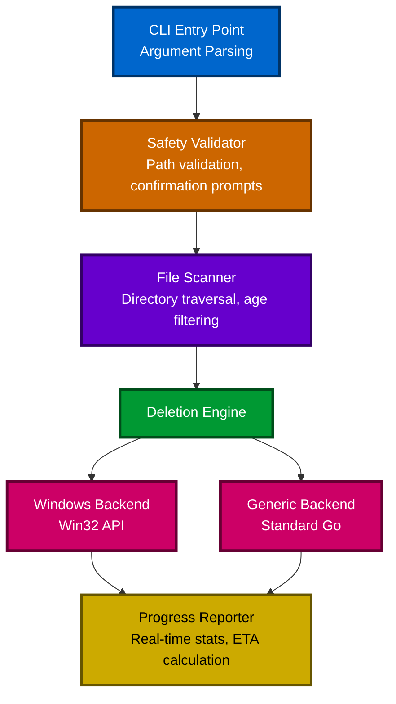

# Fast File Deletion (FFD)

⚡ **Lightning-fast file deletion tool optimized for Windows systems**

Delete millions of files in minutes, not hours. FFD is a high-performance command-line tool designed to solve the Windows filesystem bottleneck when deleting directories containing massive numbers of small files.

## 🚀 Performance

FFD dramatically outperforms traditional Windows deletion methods:

### Real-World Benchmarks

| Scenario | Files Deleted | Time Taken | Average Rate | Notes |
|----------|--------------|------------|--------------|-------|
| **FFD - Test 1** | 511,464 files | **10m 47s** | **790 files/sec** | 100% success |
| **FFD - Test 2** | 1,431,955 files | **36m 11s** | **659 files/sec** | 515K files retained (age filter) |
| **PowerShell Script** | 1,707,000 files | **~92 minutes** | **~310 files/sec** | Baseline comparison |

**FFD is 2-3x faster than traditional PowerShell scripts** and significantly faster than Windows Explorer or `rmdir /s` commands.

### Why So Fast?

- **True Parallelism**: Leverages Go's goroutines for concurrent file deletion across multiple CPU cores
- **Direct Windows API**: Uses low-level syscalls (`DeleteFile`, `RemoveDirectory`) via `golang.org/x/sys/windows`
- **Optimized Scanning**: Efficient directory traversal with minimal filesystem metadata operations
- **Smart Batching**: Processes files in optimal chunks to maximize throughput
- **Zero Overhead**: Compiled binary with no runtime dependencies or interpreter overhead

## ✨ Features

- ⚡ **Blazing Fast**: Delete millions of files in minutes with parallel processing
- 🛡️ **Safety First**: Built-in safeguards prevent accidental deletion of system directories
- 📊 **Real-Time Progress**: Live statistics showing deletion rate, progress, and ETA
- 📅 **Age-Based Filtering**: Keep recent files while cleaning up old data (`--keep-days`)
- 🔍 **Dry Run Mode**: Preview what will be deleted without actually deleting
- 📝 **Detailed Logging**: Optional verbose logging and log file output
- 🎯 **Smart Confirmation**: Path verification to prevent typos and mistakes
- 🔧 **Flexible Configuration**: Customizable worker count and behavior
- 💪 **Error Resilient**: Continues deletion even when individual files fail
- 🖥️ **Cross-Platform**: Optimized for Windows, works on Linux/macOS with standard operations

## 📦 Installation

### Option 1: Download Pre-Built Binary

Download the latest release for your platform from the [Releases](https://github.com/yourusername/fast-file-deletion/releases) page.

**Windows:**
```powershell
# Download ffd.exe and place it in your PATH
# Or run directly: .\ffd.exe -td "C:\path\to\delete"
```

**Linux/macOS:**
```bash
# Download ffd binary, make executable, and move to PATH
chmod +x ffd
sudo mv ffd /usr/local/bin/
```

### Option 2: Install via Go

```bash
go install github.com/yourusername/fast-file-deletion/cmd/fast-file-deletion@latest
```

### Option 3: Build from Source

```bash
git clone https://github.com/yourusername/fast-file-deletion.git
cd fast-file-deletion
go build -o ffd cmd/fast-file-deletion/main.go
```

## 🎯 Quick Start

### Basic Usage

```bash
# Delete a directory (with confirmation prompt)
ffd -td "C:\temp\old-logs"

# Skip confirmation prompt
ffd -td "C:\temp\cache" --force

# Preview deletion without actually deleting
ffd -td "C:\data\archive" --dry-run
```

### Age-Based Deletion

```bash
# Delete files older than 30 days
ffd -td "C:\logs" --keep-days 30

# Delete files older than 45 days with verbose logging
ffd -td "C:\Program Files\App\Logs" --keep-days 45 --verbose
```

### Advanced Options

```bash
# Custom worker count with log file
ffd -td "C:\large-directory" --workers 32 --log-file deletion.log

# Dry run with verbose output
ffd -td "C:\test" --dry-run --verbose

# Force deletion with age filter
ffd -td "C:\archive" --keep-days 90 --force
```

## 📖 Command-Line Options

```
Usage: ffd --target-directory <path> [options]
   or: ffd -td <path> [options]

Options:
  --target-directory PATH
  -td PATH                Directory to delete (required)
  --force                 Skip confirmation prompts
  --dry-run               Simulate deletion without actually deleting
  --verbose               Enable detailed logging
  --log-file PATH         Write logs to specified file
  --keep-days N           Only delete files older than N days
  --workers N             Number of parallel workers (default: auto-detect)

Examples:
  ffd -td C:\temp\old-logs
  ffd -td "C:\Program Files\old-cache" --force
  ffd --target-directory C:\temp\cache --dry-run
  ffd -td C:\data\archive --keep-days 30 --verbose
  ffd -td "/tmp/old data" --workers 8 --log-file deletion.log
```

## 🛡️ Safety Features

FFD includes multiple layers of protection to prevent accidental data loss:

### Protected Paths

The following system-critical directories are **automatically blocked**:
- `C:\Windows`
- `C:\Program Files`
- `C:\Program Files (x86)`
- `C:\Users`
- System root directories (`C:\`, `D:\`, etc. require extra confirmation)

### Confirmation Workflow

1. **Path Validation**: Checks if the target path is safe to delete
2. **Scan Summary**: Shows total files to be deleted and retained
3. **Exact Path Confirmation**: Requires typing the full path to confirm
4. **Graceful Cancellation**: Ctrl+C stops deletion cleanly with progress report

### Example Confirmation Prompt

```
╔════════════════════════════════════════════════════════════════╗
║                    DELETION CONFIRMATION                       ║
╚════════════════════════════════════════════════════════════════╝

⚠️  WARNING: You are about to permanently delete:

Path: C:\Program Files\Application\Logs
Files: 511,464 files and directories

This action CANNOT be undone!

To confirm, please type the full path exactly as shown above:
> 
```

## 📊 Output Example

```
Fast File Deletion Tool v0.1.0
Target directory: C:\Program Files\Application\Logs

Scanning directory...
Found 511,463 files and directories (511,464 to delete, 0 to retain)

✓ Confirmed. Starting deletion...

Deleting: 511,464 / 511,464 files (100.0%) | Rate: 790 files/sec | Elapsed: 10m 47s | ETA: 0s

=== Deletion Complete ===
Total time: 10m 47s
Average rate: 790 files/sec
Successfully deleted: 511,464 files

✓ Deletion completed successfully.
```

## 🔧 How It Works

### Architecture



### Key Components

1. **Safety Validator**: Prevents deletion of system-critical directories
2. **File Scanner**: Efficiently traverses directory trees with optional age filtering
3. **Deletion Engine**: Coordinates parallel deletion using goroutine worker pools
4. **Platform Backends**: Windows-optimized (Win32 API) or generic (standard Go)
5. **Progress Reporter**: Real-time statistics with deletion rate and ETA

### Windows Optimizations

On Windows systems, FFD uses:
- Direct `DeleteFile` and `RemoveDirectory` syscalls via `golang.org/x/sys/windows`
- Extended-length path support (`\\?\` prefix) for paths longer than 260 characters
- Optimized error handling for Windows-specific error codes
- Parallel processing tuned for NTFS filesystem characteristics

## 🐛 Error Handling

FFD is designed to be resilient and continue operation even when individual files fail:

- **Permission Errors**: Logs error, skips file, continues with remaining files
- **Locked Files**: Attempts to skip locked files and continues deletion
- **Interruption (Ctrl+C)**: Stops gracefully and reports progress
- **Detailed Logging**: All errors are logged with full context

### Exit Codes

- `0`: Success (all files deleted)
- `1`: Partial failure (some files could not be deleted)
- `2`: Complete failure (operation could not proceed)

## 🧪 Testing

FFD uses a comprehensive testing strategy:

- **Unit Tests**: Verify specific scenarios and edge cases
- **Property-Based Tests**: Verify correctness across random inputs using [Rapid](https://github.com/flyingmutant/rapid)
- **Integration Tests**: End-to-end workflow validation

Run tests:
```bash
go test ./...
```

Run with coverage:
```bash
go test -cover ./...
```

## 🤝 Contributing

Contributions are welcome! Please feel free to submit a Pull Request.

### Development Setup

```bash
# Clone repository
git clone https://github.com/yourusername/fast-file-deletion.git
cd fast-file-deletion

# Install dependencies
go mod download

# Run tests
go test ./...

# Build
go build -o ffd cmd/fast-file-deletion/main.go
```

## 📄 License

This project is licensed under the MIT License - see the [LICENSE](LICENSE) file for details.

## ⚠️ Disclaimer

**USE AT YOUR OWN RISK**. This tool permanently deletes files and directories. While it includes safety features, always:
- Double-check the target path before confirming
- Use `--dry-run` first to preview what will be deleted
- Keep backups of important data
- Test on non-critical directories first

The authors are not responsible for any data loss resulting from the use of this tool.

## 🙏 Acknowledgments

- Built with [Go](https://golang.org/)
- Windows API integration via [golang.org/x/sys/windows](https://pkg.go.dev/golang.org/x/sys/windows)
- Property-based testing with [Rapid](https://github.com/flyingmutant/rapid)

## 📞 Support

- **Issues**: [GitHub Issues](https://github.com/yourusername/fast-file-deletion/issues)
- **Discussions**: [GitHub Discussions](https://github.com/yourusername/fast-file-deletion/discussions)

---

**Made with ⚡ by developers who are tired of waiting for Windows to delete files**
